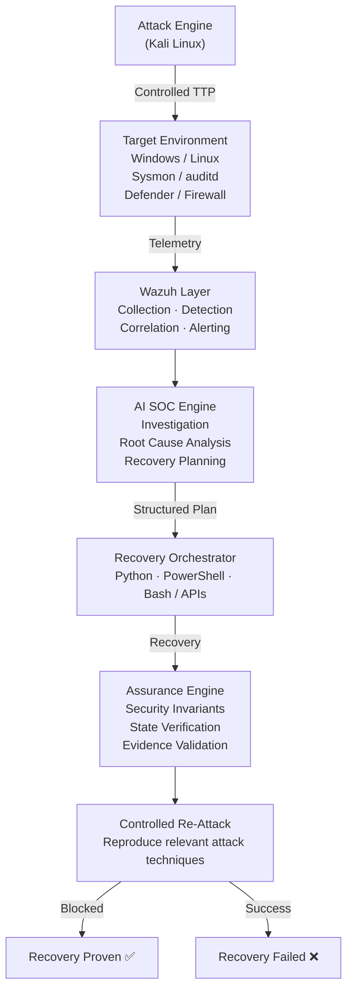
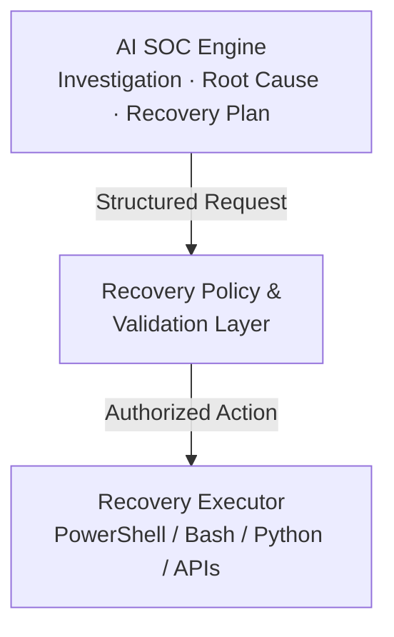

<div align="center">

# AI Cyber Recovery Assurance

**AI-Assisted Incident Recovery with Independent Security Verification and Controlled Re-Attack Validation**

[]()
[]()
[]()
[]()

> Recovery is not considered successful until the recovered environment passes independent security verification and survives controlled re-attack.

</div>

---

## Table of Contents

- [Overview](#overview)
- [Research Problem](#research-problem)
- [Research Question](#research-question)
- [System Model](#system-model)
- [Core Methodology](#core-methodology)
- [AI / Security Boundary](#ai--security-boundary)
- [Security Invariants](#security-invariants)
- [Evaluation Framework](#evaluation-framework)
- [Experimental Scenarios](#experimental-scenarios)
- [Technology Stack](#technology-stack)
- [Repository Structure](#repository-structure)
- [Development Roadmap](#development-roadmap)
- [Research Contribution](#research-contribution)
- [Current Status](#current-status)
- [Safety & Scope](#safety--scope)
- [License](#license)

---

## Overview

**AI Cyber Recovery Assurance** is a cybersecurity research and engineering project investigating how AI-assisted incident recovery can be **independently verified**.

Modern security operations increasingly rely on AI to investigate alerts, correlate evidence, identify probable root causes, and recommend response actions. However, generating a recovery plan does not, by itself, demonstrate that a compromised environment has actually returned to a secure state.

This project introduces an **additional assurance layer** between recovery and incident closure. The system:

1. Investigates the incident
2. Generates a structured recovery plan
3. Executes controlled recovery actions
4. Evaluates predefined security invariants
5. Reproduces relevant attack techniques in an isolated environment
6. Determines whether the recovered state withstands re-validation

Recovery verification is treated as an **explicit security problem**, rather than an assumption that successful remediation commands imply successful recovery.

---

## Research Problem

A conventional incident-response lifecycle can be simplified as:

```
Detection → Investigation → Response → Recovery → Closure
```

The problem is that **operational recovery** and **security recovery** are not necessarily equivalent. A system may be available again while:

- Compromised credentials remain valid
- Persistence mechanisms remain active
- Unauthorized accounts remain
- Security controls remain degraded
- Telemetry is incomplete
- The original exploitation path remains available

This project investigates whether recovery can be evaluated through an **independently verifiable security state**.

### Research Question

> Can an AI-assisted incident recovery workflow be independently verified through security invariants and controlled re-attack validation to determine whether a compromised environment has actually recovered securely?

---

## System Model



---

## Core Methodology

The system is built around four stages.

### 01 — Recovery

The AI analyzes the incident and generates a structured recovery plan:

```json
{
  "action": "disable_account",
  "target": "user123",
  "reason": "suspected credential compromise",
  "risk": "medium"
}
```

The AI does not directly execute unrestricted privileged commands. All actions pass through the recovery orchestration layer.

### 02 — Assurance

After recovery, an independent verification engine evaluates whether required security conditions are satisfied, including:

- Compromised account disabled
- Credentials rotated
- Malicious process removed
- Persistence removed
- Unauthorized administrative access removed
- Firewall configuration restored
- Endpoint security agent active
- Telemetry restored
- Exploited vulnerability remediated
- Malicious network connection removed

Each invariant produces one of: `PASS` · `FAIL` · `UNKNOWN`

### 03 — Re-Validation

The system safely reproduces relevant portions of the original attack inside the isolated laboratory. The goal is **not** to generate damage — it is to answer:

> Can the same security failure still be reproduced after recovery?

### 04 — Recovery Proof

The final recovery state combines invariant verification and controlled re-attack results, producing one of:

`PROVEN` · `PARTIALLY PROVEN` · `FAILED` · `UNKNOWN`

The exact decision logic will be defined and evaluated experimentally during implementation.

---

## AI / Security Boundary

A fundamental design principle is the **separation between AI reasoning and privileged execution**.



This architecture prevents the language model from being treated as an unrestricted system administrator.

---

## Security Invariants

Security invariants represent conditions that should hold after recovery.

| Category | Example |
|---|---|
| Identity | Compromised account disabled |
| Credentials | Compromised credentials rotated |
| Persistence | Malicious persistence removed |
| Process | Malicious process terminated |
| Network | Unauthorized connection removed |
| Firewall | Expected policy restored |
| Endpoint | Security agent operational |
| Telemetry | Required logs available |
| Vulnerability | Exploited weakness remediated |
| Backup | Recovery source verified |

The Assurance Engine evaluates these conditions **independently** from the AI's own conclusion.

---

## Evaluation Framework

| Metric | Description |
|---|---|
| Recovery Success Rate | Percentage of scenarios reaching verified recovery |
| Invariant Pass Rate | Percentage of required invariants satisfied |
| Re-Attack Success Rate | Percentage of scenarios where the original compromise remains reproducible |
| False Recovery Rate | Cases where recovery appears successful but fails independent validation |
| Recovery Time | Time from incident identification to verified recovery |
| Manual Intervention | Human actions required during recovery |
| AI Plan Accuracy | Correctness of recommended recovery actions |
| Verification Coverage | Percentage of relevant security conditions tested |

These metrics will be measured across multiple controlled attack scenarios.

---

## Experimental Scenarios

The initial laboratory will focus on controlled scenarios such as:

- **Credential Compromise**
  - Account Abuse
  - Credential Rotation
- **Persistence**
  - Scheduled Task
  - Startup Persistence
- **Privilege Escalation**
  - Controlled Privilege Abuse
- **Execution**
  - Suspicious PowerShell
- **Lateral Movement**
  - Controlled Remote Access
- **Ransomware Simulation**
  - Non-destructive Recovery Validation

All scenarios run exclusively inside the isolated laboratory.

---

## Technology Stack

| Layer | Technology |
|---|---|
| Endpoint Monitoring | Sysmon, Windows Event Logs, auditd |
| SIEM / XDR | Wazuh |
| AI / Automation | Python, LLM API, Pydantic |
| Recovery | Python, PowerShell, Bash |
| Attack Simulation | Kali Linux |
| Virtualization | VMware |
| Testing | pytest |
| Version Control | Git / GitHub |
| Future UI | Web-based dashboard |

---

## Repository Structure

```
AI-Cyber-Recovery-Assurance/
│
├── ai_engine/
│   ├── investigation.py
│   ├── recovery_planner.py
│   └── prompts/
│
├── recovery/
│   ├── orchestrator.py
│   ├── actions/
│   └── rollback/
│
├── assurance/
│   ├── engine.py
│   ├── invariants/
│   ├── persistence_checks.py
│   ├── identity_checks.py
│   ├── telemetry_checks.py
│   └── network_checks.py
│
├── re_attack/
│   ├── scenarios/
│   ├── simulator.py
│   └── validator.py
│
├── attacks/
│   ├── persistence/
│   ├── credential_compromise/
│   ├── privilege_escalation/
│   └── ransomware_simulation/
│
├── experiments/
│   ├── baseline/
│   ├── results/
│   └── evaluation.py
│
├── dashboard/
│
├── docs/
│   ├── methodology.md
│   ├── threat_model.md
│   └── research.md
│
└── tests/
```

---

## Development Roadmap

| # | Milestone |
|---|---|
| 01 | Repository & Development Environment |
| 02 | Isolated Security Laboratory |
| 03 | Endpoint Telemetry |
| 04 | Wazuh Detection Pipeline |
| 05 | Controlled Attack Scenarios |
| 06 | AI Investigation Engine |
| 07 | Recovery Planner |
| 08 | Recovery Orchestrator |
| 09 | Security Assurance Engine |
| 10 | Controlled Re-Attack |
| 11 | Recovery Proof |
| 12 | Experimental Evaluation |
| 13 | Dashboard & Research Documentation |

---

## Research Contribution

This project does not claim that AI-assisted recovery, security verification, or adversarial validation individually originate here.

Instead, the project focuses on implementing and experimentally evaluating a specific **integrated workflow**:

```
AI Recovery → Independent Security Assurance → Controlled Re-Attack → Recovery Proof
```

The goal is to investigate whether this workflow can reduce the gap between *"the recovery procedure completed"* and *"the security failure was actually remediated."*

---

## Current Status

**Phase 01 — Repository & Architecture**

| Component | Progress |
|---|---|
| Repository | `████████████████████` 100% |
| Architecture | `████████████████████` 100% |
| Lab Environment | `░░░░░░░░░░░░░░░░░░░░` 0% |
| Detection Pipeline | `░░░░░░░░░░░░░░░░░░░░` 0% |
| AI Investigation | `░░░░░░░░░░░░░░░░░░░░` 0% |
| Recovery Engine | `░░░░░░░░░░░░░░░░░░░░` 0% |
| Assurance Engine | `░░░░░░░░░░░░░░░░░░░░` 0% |
| Re-Attack Validation | `░░░░░░░░░░░░░░░░░░░░` 0% |
| Evaluation | `░░░░░░░░░░░░░░░░░░░░` 0% |

Experimental results will be added only after implementation and controlled testing.

---

## Safety & Scope

> ⚠️ This project is intended **exclusively** for authorized cybersecurity research and isolated laboratory environments.

- Attack simulations must be performed only against systems owned by the researcher or explicitly authorized for testing.
- No real-world infrastructure, credentials, accounts, or third-party systems are targeted.

---

<div align="center">

**Recovery should not be trusted simply because it completed. It should be verified.**

`AI` · `SOC` · `Incident Response` · `Security Assurance` · `Adversarial Validation`

</div>

---

## License

This project is licensed under the [MIT License](LICENSE).
